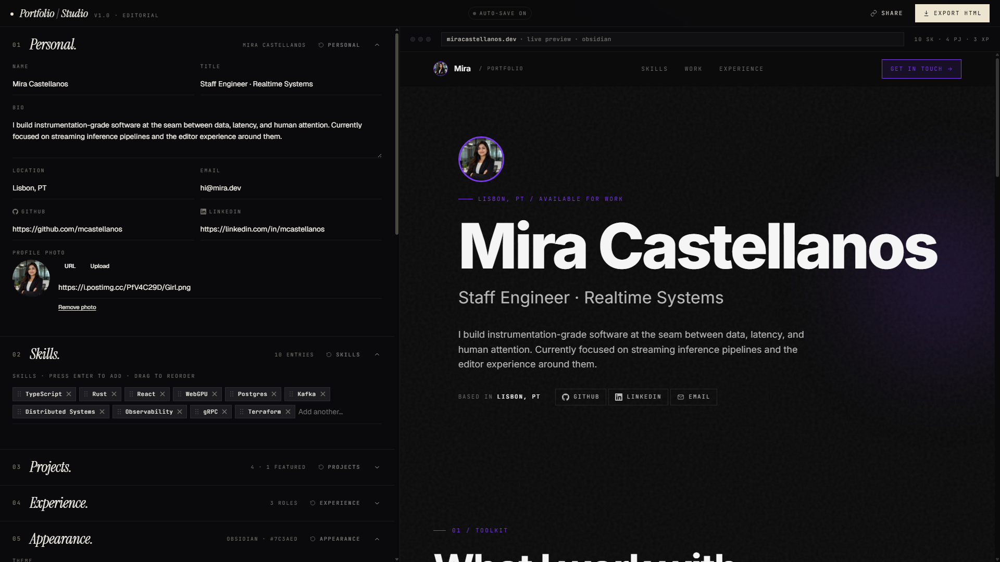
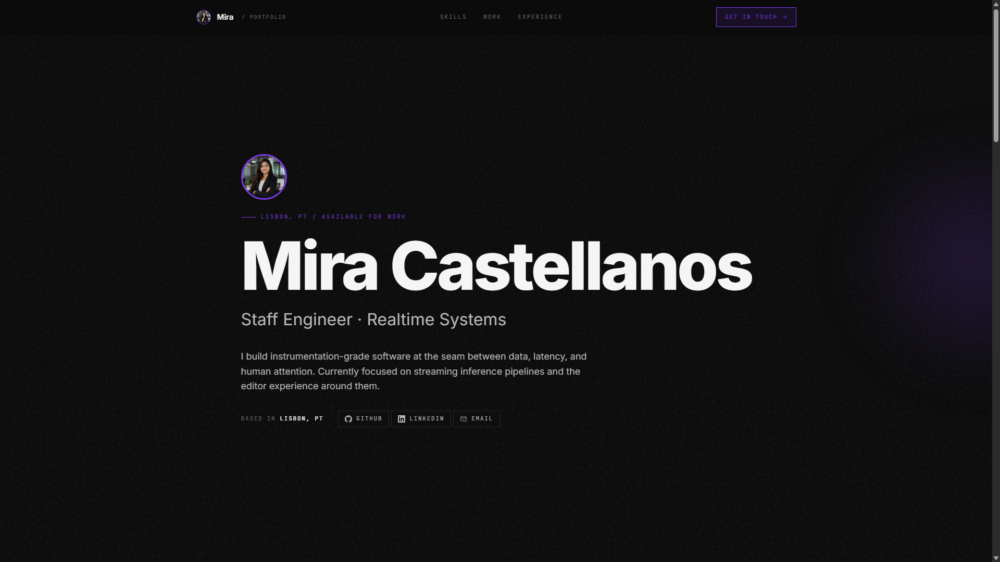

<div align="center">


# Portfolio Studio

**A browser-based developer portfolio builder with live preview, five distinct themes, AI-assisted content, and zero-dependency HTML export. No signup. No watermark. Yours completely.**

[Live Demo](https://portfolio-studio-deploy.vercel.app) · [Report an Issue](https://github.com/sahil-7-dev/portfolio-studio-deploy/issues)

</div>

---

## Screenshots

| Editor & Live Preview | Exported Output |
|---|---|
|  |  |

---

## Why I Built This

Most portfolio builders have at least one of these problems:

- Watermark your exported work unless you pay
- Require a signup just to see a template
- Lock clean themes behind a subscription
- Cap how many times you can export or edit
- Have bloated UIs that get in the way

I wanted something that does none of that. Free. Clean UI. No signup. No watermark. No subscription. Unlimited exports. You fill in your details, pick a theme, and get a self-contained HTML file that you own completely — no strings attached.

---

## Overview

The stack is intentionally lean: React + Vite on the frontend, a single Vercel serverless function proxying all AI calls, localStorage for persistence. No database, no auth, no managed backend.

---

## Features

| | |
|---|---|
| **Live Preview** | Split-screen editor and preview update in real time on every keystroke. No save button. |
| **Five Themes** | Obsidian (dark minimal), Arctic (light clean), Terminal (neon green monospace), Aurora (glassmorphism + particles), InternSphere (dark pill-shaped UI, purple gradient). Each is a complete CSS variable swap — no page reload. |
| **Profile Photo** | Upload from device (JPG, PNG, WebP, GIF, AVIF, SVG · max 5MB) or paste any direct image URL. Shows in both the hero section and navbar. |
| **AI Bio Generator** | Generates a sharp 2–3 sentence professional bio from name, title, and skills via Gemini 2.0 Flash. |
| **AI Description Enhancer** | Polishes rough project descriptions into recruiter-optimised copy. |
| **AI Skills Suggester** | Suggests 5 complementary skills based on existing stack — rendered as one-click add chips. |
| **Export HTML** | Produces a complete self-contained HTML file with all CSS inlined and fonts imported. Works offline. Zero external dependencies in the output. Unlimited exports. |
| **Share Link** | Serialises the entire portfolio state to a compressed base64 URL param. No backend — all state lives in the URL. |
| **Auto-save** | Debounced localStorage sync on every state change. Restores on reload. Base64 image data is excluded from storage to avoid mobile quota limits. |
| **Accent Color System** | Pick any hex color — buttons, borders, chips, and hover states all derive from a single CSS variable. |
| **Responsive** | Split-screen on desktop, tab switcher on tablet and mobile. Lenis smooth scroll on desktop only — native scroll on touch devices. |

---

## Architecture

```
┌─────────────┐     HTTPS      ┌──────────────────────┐     Gemini API
│   Browser   │ ─────────────► │  Vercel (React SPA)  │ ──────────────►  Google Gemini 2.0 Flash
│  React+Vite │ ◄───────────── │  + /api/gemini (fn)  │
└─────────────┘                └──────────────────────┘
       │
       │  localStorage (auto-save, base64 excluded)
       ▼
  Browser Storage
```

All AI requests pass through `/api/gemini`. The Gemini API key is a Vercel environment variable — never in the client bundle. Per-IP rate limits (4 req/min, 10 req/day) enforced at the proxy via Upstash Redis.

---

## Themes

| Theme | Background | Font | Special |
|---|---|---|---|
| `obsidian` | `#0a0a0a` | Inter | Subtle grain overlay |
| `arctic` | `#ffffff` | DM Sans | Clean geometric cards |
| `terminal` | `#0d1117` | JetBrains Mono | Scanline overlay, blinking cursor |
| `aurora` | `#050818` | Inter | Glassmorphism cards, floating particles |
| `internsphere` | `#0f1013` | Inter | Pill-shaped UI, purple → violet → pink brand gradient |

---

## AI Rate Limiting

Three layers of protection on every AI request:

- **Layer 1 — Origin check**: proxy rejects requests not from the app domain
- **Layer 2 — IP rate limit**: 4 req/min, 10 req/day per IP via Upstash Redis. Fails open if Redis is unavailable.
- **Layer 3 — Client throttle**: 8s cooldown between calls enforced client-side

---

## Component Structure

```
src/
├── components/
│   ├── EditorPanel/
│   │   ├── PersonalSection.jsx      — photo upload + URL + live preview
│   │   ├── SkillsSection.jsx        — tag input, drag to reorder
│   │   ├── ProjectsSection.jsx      — featured toggle, tech tags
│   │   ├── ExperienceSection.jsx    — bullet-point entries
│   │   └── AppearanceSection.jsx    — theme, accent color, font
│   ├── PreviewPanel/
│   │   ├── PreviewPanel.jsx         — Lenis desktop only
│   │   ├── PreviewWrapper.jsx       — theme class, CSS variable injection
│   │   ├── HeroSection.jsx          — typewriter title, avatar
│   │   ├── PreviewNav.jsx           — sticky nav, hamburger on mobile
│   │   ├── PreviewSkills.jsx        — IntersectionObserver entrance animation
│   │   ├── ProjectsGrid.jsx         — featured card + regular grid
│   │   └── ExperienceTimeline.jsx   — vertical timeline
│   └── AIPanel/
│       ├── BioGenerator.jsx
│       ├── DescriptionEnhancer.jsx
│       └── SkillsSuggester.jsx
└── utils/
    ├── ai.js          — Gemini proxy calls + 8s client throttle
    ├── colors.js      — accent hex → CSS variable scale derivation
    ├── exportHTML.js  — self-contained HTML generator
    ├── share.js       — base64 URL state serialisation
    └── storage.js     — debounced localStorage, strips base64 before save
```

---

## Local Development

```bash
git clone https://github.com/sahil-7-dev/portfolio-studio-deploy.git
cd portfolio-studio-deploy
npm install
cp .env.local.example .env.local
# Add your GEMINI_API_KEY to .env.local
npm run dev
```

**Vercel environment variables:**

```
GEMINI_API_KEY              # Required
ALLOWED_ORIGINS             # Your Vercel domain
UPSTASH_REDIS_REST_URL      # Optional — enables IP rate limiting
UPSTASH_REDIS_REST_TOKEN    # Optional
```

---

## Known Behaviours

- Uploaded photos (base64) are not persisted to localStorage — they reset on page reload. URL-based avatars persist normally. Intentional — prevents mobile storage quota exhaustion.
- If no photo is uploaded or URL provided, the avatar falls back to initials derived from the name field.
- Lenis is disabled on touch devices. Native momentum scroll is used instead to avoid GPU compositing issues on mobile.
- Share links encode the full portfolio state in the URL. Large portfolios may produce long URLs.
- Image uploads are validated client-side: JPG, PNG, WebP, GIF, AVIF, SVG only, 5MB max.

---

## License

[MIT](./LICENSE)
